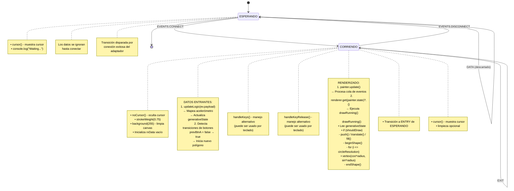
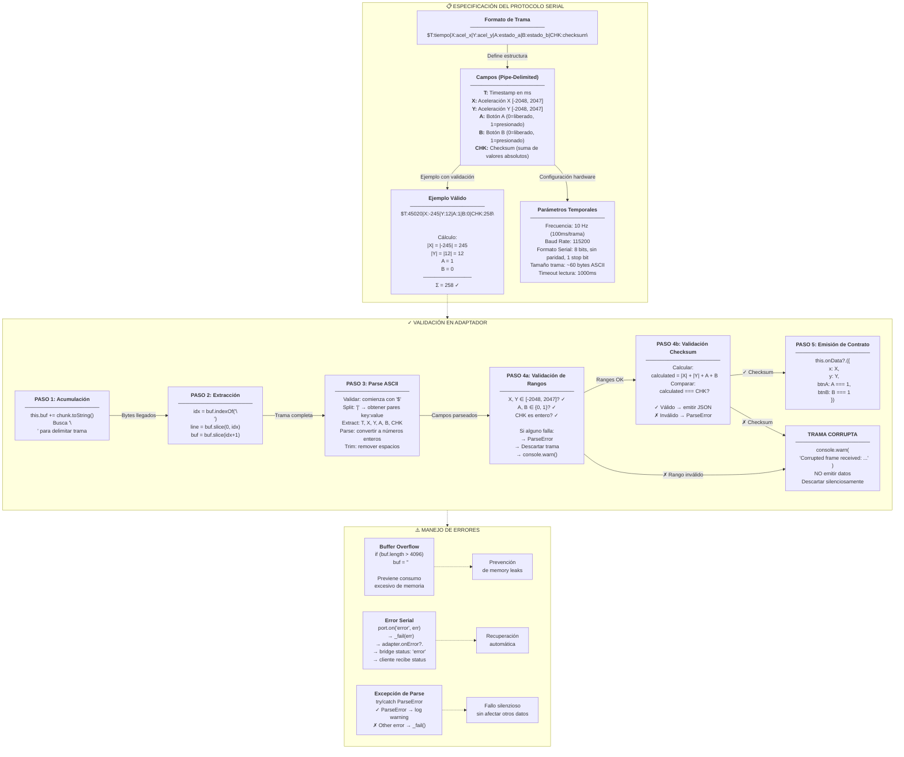
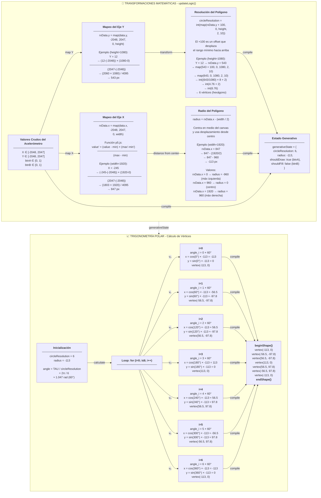
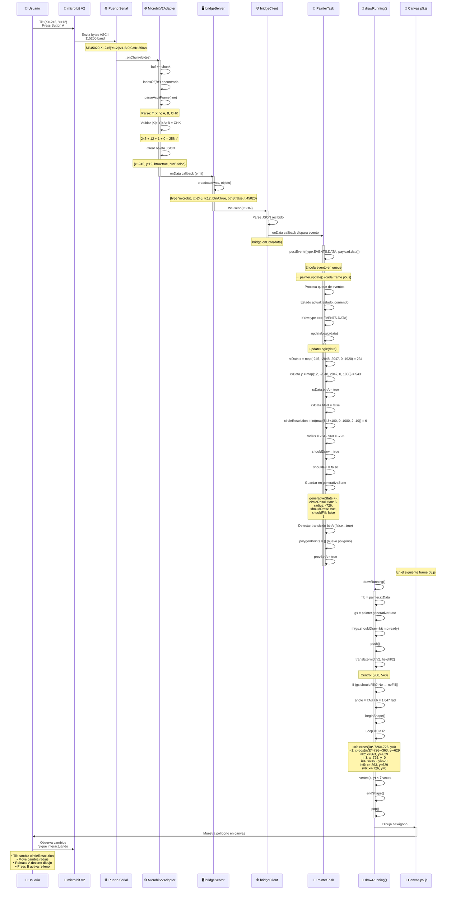

# unidad 5


## 📋 Tabla de Contenidos

1. [Arquitectura General del Sistema](#1-arquitectura-general-del-sistema)
2. [Transformación de Datos a Través del Sistema](#2-transformación-de-datos-a-través-del-sistema)
3. [Máquina de Estados Finitos (FSM)](#3-máquina-de-estados-finitos-fsm)
4. [Protocolo Serial ASCII - Especificación y Validación](#4-protocolo-serial-ascii---especificación-y-validación)
5. [Transformaciones Matemáticas y Cálculo de Vértices](#5-transformaciones-matemáticas-y-cálculo-de-vértices)
6. [Arquitectura de Componentes y Clases](#6-arquitectura-de-componentes-y-clases)
7. [Diagrama de Secuencia - Flujo Temporal Completo](#7-diagrama-de-secuencia---flujo-temporal-completo)
8. [Vista Integrada del Sistema - Todas las Capas](#8-vista-integrada-del-sistema---todas-las-capas)
9. [Capas del Sistema - Responsabilidades Diferenciadas](#9-capas-del-sistema---responsabilidades-diferenciadas)

---

## 1. Arquitectura General del Sistema

```mermaid
graph TB
    subgraph HARDWARE["🔧 CAPA FÍSICA - HARDWARE"]
        MICROBIT["<b>micro:bit V2</b><br/>Acelerómetro + Botones<br/>115200 baud"]
        SENSORS["<b>Sensores</b><br/>• Acelerómetro 3-ejes (X,Y,Z)<br/>• Botón A<br/>• Botón B<br/>• RTC (Real Time Clock)"]
        MICROBIT ---|Datos cada 100ms<br/>10 Hz| SENSORS
    end

    subgraph TRANSPORT["🌐 CAPA DE TRANSPORTE - PUERTO SERIAL"]
        SERIAL["<b>Puerto Serial</b><br/>COM5 @115200 baud<br/>8-N-1"]
        FRAMEBUFFER["<b>Buffer de Trama</b><br/>Acumula bytes hasta \\n"]
        PROTOCOL["<b>Protocolo ASCII</b><br/><br/>$T:timestamp|X:acel_x|Y:acel_y<br/>|A:btn_a|B:btn_b|CHK:checksum\\n"]
        
        SENSORS -->|TX ASCII bytes| SERIAL
        SERIAL -->|chunk events| FRAMEBUFFER
        FRAMEBUFFER -->|rawLine| PROTOCOL
    end

    subgraph ADAPTER["⚙️ CAPA DE ADAPTACIÓN - PARSE & VALIDACIÓN"]
        V2ADAPTER["<b>MicrobitV2Adapter</b><br/>(extends BaseAdapter)"]
        PARSER["<b>parseAsciiFrame()</b><br/>Extrae campos del protocolo<br/>• T: timestamp<br/>• X, Y: [-2048, 2047]<br/>• A, B: 0|1<br/>• CHK: suma"]
        VALIDATOR["<b>Validación Checksum</b><br/>Calcula: |X| + |Y| + A + B<br/>Compara con CHK recibido"]
        STANDARDIZE["<b>Contrato Estándar</b><br/>{<br/>&nbsp;&nbsp;x: int,<br/>&nbsp;&nbsp;y: int,<br/>&nbsp;&nbsp;btnA: bool,<br/>&nbsp;&nbsp;btnB: bool<br/>}"]
        CORRUPT["<b>Trama Corrupta</b><br/>console.warn()<br/>Descarta silenciosamente"]
        
        PROTOCOL -->|rawLine| V2ADAPTER
        V2ADAPTER -->|_onChunk()| PARSER
        PARSER -->|parsed| VALIDATOR
        VALIDATOR -->|✓ Valid| STANDARDIZE
        VALIDATOR -->|✗ Invalid| CORRUPT
    end

    subgraph SERVER["🖥️ CAPA DE SERVIDOR - Node.js WebSocket"]
        BRIDGE["<b>bridgeServer.js</b><br/>WebSocket Server<br/>localhost:8081"]
        BROADCAST["<b>broadcast()</b><br/>Envía a todos los clientes<br/>conectados"]
        WSJSON["<b>Mensaje WebSocket</b><br/>{<br/>&nbsp;&nbsp;type: 'microbit',<br/>&nbsp;&nbsp;x: int,<br/>&nbsp;&nbsp;y: int,<br/>&nbsp;&nbsp;btnA: bool,<br/>&nbsp;&nbsp;btnB: bool,<br/>&nbsp;&nbsp;t: timestamp<br/>}"]
        
        STANDARDIZE -->|adapter.onData()| BRIDGE
        BRIDGE -->|broadcast()| BROADCAST
        BROADCAST -->|send JSON| WSJSON
    end

    subgraph CLIENT["🌐 CAPA DE CLIENTE - Navegador p5.js"]
        BRIDGECLIENT["<b>bridgeClient.js</b><br/>WebSocket Cliente"]
        EVENTS["<b>EVENTS.DATA</b><br/>Evento disparado"]
        PAYLOAD["<b>Payload</b><br/>{<br/>&nbsp;&nbsp;x: int,<br/>&nbsp;&nbsp;y: int,<br/>&nbsp;&nbsp;btnA: bool,<br/>&nbsp;&nbsp;btnB: bool<br/>}"]
        
        WSJSON -->|WS message| BRIDGECLIENT
        BRIDGECLIENT -->|parseJSON| EVENTS
        EVENTS -->|ev.payload| PAYLOAD
    end

    PAYLOAD -->|bridge.onData()| FSM
    
    subgraph FSM["🎯 CAPA DE ESTADO - Máquina de Estados"]
        FSMMAIN["<b>PainterTask (FSM)</b><br/>Finite State Machine"]
        STATE_WAIT["<b>estado_esperando</b><br/>• Espera conexión<br/>• Muestra cursor"]
        STATE_RUN["<b>estado_corriendo</b><br/>• Activo<br/>• Cursor oculto"]
        STATE_TRANS["EVENTS.CONNECT"]
        
        FSMMAIN ---|Initial| STATE_WAIT
        STATE_WAIT ---|EVENTS.CONNECT| STATE_TRANS
        STATE_TRANS -->|transitionTo()| STATE_RUN
        
        PAYLOAD -->|postEvent(DATA)| STATE_RUN
        STATE_RUN -->|ev.type === DATA| UPDATELOGIC
        
        subgraph UPDATELOGIC["📥 updateLogic(data)"]
            RXDATA["<b>rxData</b><br/>Datos mapeados<br/>x, y: [0, width/height]<br/>btnA, btnB: bool<br/>ready: bool"]
            GENSTATE["<b>generativeState</b><br/>circleResolution: [2,10]<br/>radius: pixel distance<br/>shouldDraw: bool<br/>shouldFill: bool<br/>polygonPoints: array"]
            MAPX["map(X, -2048, 2047,<br/>0, width)"]
            MAPY["map(Y, -2048, 2047,<br/>0, height)"]
            RESOLUTION["circleResolution =<br/>int(map(Y+100, 0, height, 2, 10))"]
            RADIUS["radius =<br/>X - width/2"]
            
            PAYLOAD -->|data| RXDATA
            RXDATA -->|Store| MAPX
            RXDATA -->|Store| MAPY
            MAPX & MAPY -->|Transform| RESOLUTION
            MAPX & MAPY -->|Transform| RADIUS
            RESOLUTION & RADIUS -->|Store| GENSTATE
        end
    end

    GENSTATE -->|read| DRAWRUNNING
    
    subgraph RENDER["🎨 CAPA DE RENDER - p5.js Canvas"]
        DRAWRUNNING["<b>drawRunning()</b><br/>Ejecuta cada frame"]
        PUSHPOP["push() / pop()<br/>Salva matriz de transformación"]
        TRANSLATE["translate(width/2, height/2)<br/>Centra en canvas"]
        CONDITION["if (shouldDraw &&<br/>ready)"]
        FILL["if (shouldFill)<br/>fill(34, 45, 122, 50)<br/>else noFill()"]
        LOOP["for (i=0; i<=circleResolution)<br/>angle = TAU/circleResolution"]
        VERTEX["x = cos(angle*i)*radius<br/>y = sin(angle*i)*radius<br/>vertex(x, y)"]
        SHAPE["beginShape()<br/>... vertices ...<br/>endShape()"]
        
        DRAWRUNNING -->|every frame| CONDITION
        CONDITION -->|true| PUSHPOP
        PUSHPOP -->|init| TRANSLATE
        TRANSLATE -->|prepare| FILL
        FILL -->|style| SHAPE
        LOOP -->|calculate| VERTEX
        VERTEX -->|add| SHAPE
    end

    SHAPE -->|render| CANVAS["<b>Canvas 720x720</b><br/>Polígono generativo"]
    
    CANVAS -->|visual feedback| USER["👁️ Usuario"]
    USER -->|tilt device| SENSORS
    USER -->|press buttons| SENSORS
```

### Descripción

Este diagrama muestra el **flujo completo del sistema** desde el hardware físico hasta la visualización en el navegador:

- **Capa Física**: micro:bit V2 con acelerómetro y botones
- **Transporte Serial**: Puerto COM5 a 115200 baud con protocolo ASCII
- **Adaptador**: MicrobitV2Adapter que parsea y valida tramas
- **Servidor**: Node.js WebSocket que broadcast datos
- **Cliente**: p5.js recibe eventos y actualiza
- **FSM**: Máquina de estados que mapea datos → variables gráficas
- **Renderizado**: drawRunning() dibuja polígonos en canvas
- **Feedback**: Usuario observa cambios y continúa interactuando

---

## 2. Transformación de Datos a Través del Sistema

```mermaid
graph LR
    subgraph FLOW["FLUJO DE DATOS A TRAVÉS DEL SISTEMA"]
        direction LR
        
        H1["<b>HARDWARE</b><br/>Valores Crudos<br/><br/>acélX: -245<br/>acélY: 12<br/>btnA: 1<br/>btnB: 0<br/>T: 45020ms"]
        
        H2["<b>PUERTO SERIAL</b><br/>Bytes ASCII<br/><br/>$ T : 4 5 0 2 0<br/>| X : - 2 4 5<br/>| Y : 1 2<br/>| A : 1<br/>| B : 0<br/>| C H K : 2 5 8 \\n"]
        
        H3["<b>BUFFER</b><br/>Acumula<br/><br/>buf += chunk<br/>buf.indexOf('\\n')<br/>extract line"]
        
        H4["<b>FRAME</b><br/>Trama Completa<br/><br/>$T:45020|X:-245|Y:12<br/>|A:1|B:0|CHK:258\\n"]
        
        H5["<b>PARSER</b><br/>Parse Campos<br/><br/>T: 45020<br/>X: -245<br/>Y: 12<br/>A: 1<br/>B: 0<br/>CHK: 258"]
        
        H6["<b>VALIDATOR</b><br/>Checksum<br/><br/>calc = |-245|+|12|+1+0<br/>     = 245+12+1+0<br/>     = 258<br/>✓ CHK==calc"]
        
        H7["<b>CONTRATO</b><br/>JSON Estándar<br/><br/>{<br/>  x: -245,<br/>  y: 12,<br/>  btnA: true,<br/>  btnB: false<br/>}"]
        
        H8["<b>BROADCAST</b><br/>WebSocket<br/><br/>{<br/>  type: 'microbit',<br/>  x: -245,<br/>  y: 12,<br/>  btnA: true,<br/>  btnB: false,<br/>  t: 45020<br/>}"]
        
        H9["<b>rxData</b><br/>Mapeado Canvas<br/><br/>x: map(-245,<br/>   -2048,2047,<br/>   0,1920)<br/> = 234px<br/><br/>y: map(12,<br/>   -2048,2047,<br/>   0,1080)<br/> = 540px<br/><br/>btnA: true<br/>btnB: false"]
        
        H10["<b>generativeState</b><br/>Parámetros Gráficos<br/><br/>resolution=<br/>int(map(540+100,<br/>   0,1080,2,10))<br/> = 7<br/><br/>radius=<br/>234-960= -726<br/><br/>shouldDraw: true<br/>shouldFill: false"]
        
        H11["<b>RENDER</b><br/>Cálculo Vértices<br/><br/>angle = TAU/7 ≈ 90°<br/>v0: cos(0)*-726,    sin(0)*-726<br/>v1: cos(90°)*-726,  sin(90°)*-726<br/>v2: cos(180°)*-726, sin(180°)*-726<br/>..."]
        
        H12["<b>CANVAS</b><br/>Polígono Dibujado<br/><br/>beginShape()<br/>vertex(-726, 0)<br/>vertex(0, -726)<br/>vertex(726, 0)<br/>vertex(0, 726)<br/>endShape()"]
        
        H1 -->|Serial 115200| H2
        H2 -->|chunk events| H3
        H3 -->|indexOf \\n| H4
        H4 -->|parse| H5
        H5 -->|validate| H6
        H6 -->|emit| H7
        H7 -->|broadcast| H8
        H8 -->|WS recv| H9
        H9 -->|calculate| H10
        H10 -->|trigonometry| H11
        H11 -->|p5.js| H12
    end
```



### Descripción

Un ejemplo **paso a paso** mostrando cómo se transforma un único dato desde el hardware:

1. Hardware envía: X=-245, Y=12, A=1, B=0
2. Bytes ASCII transmitidos por serial
3. Se acumulan en buffer hasta encontrar `\n`
4. Trama completa parseada
5. Campos extraídos
6. **Validación de checksum**: 245 + 12 + 1 + 0 = 258 ✓
7. JSON contrato emitido
8. WebSocket broadcast
9. Datos mapeados a canvas: X→234px, Y→540px
10. generativeState calculado: circleResolution=7, radius=-726
11. Trigonometría calcula vértices
12. Polígono dibujado en canvas

---

## 3. Máquina de Estados Finitos (FSM)



### Descripción

La **máquina de estados** controla el flujo de la aplicación:

- **estado_esperando**: Aplicación inactiva, esperando conexión del adaptador
- **estado_corriendo**: Aplicación activa, recibiendo datos, renderizando
- El evento **EVENTS.DATA** dispara `updateLogic()` que mapea datos y calcula parámetros
- El ciclo de **draw()** del p5.js ejecuta `drawRunning()` que lee el estado y renderiza

---

## 4. Protocolo Serial ASCII - Especificación y Validación



### Descripción

Especificación técnica completa del protocolo serial:

- **Formato**: `$T:timestamp|X:acel_x|Y:acel_y|A:btn_a|B:btn_b|CHK:checksum\n`
- **Validación de 5 pasos**: Acumulación → Extracción → Parse → Range check → Checksum
- **Checksum**: Suma de |X| + |Y| + A + B, debe coincidir con CHK
- **Manejo de errores**: Buffer overflow, errores seriales, excepciones de parse

---

## 5. Transformaciones Matemáticas y Cálculo de Vértices



### Descripción

Transformaciones matemáticas completas:

- **Map X y Y**: Convierte rango de acelerómetro [-2048, 2047] al espacio de canvas [0, width/height]
- **circleResolution**: Número de vértices del polígono, entre 2 y 10, basado en Y
- **radius**: Distancia desde el centro del canvas, basado en X
- **Trigonometría polar**: Calcula cada vértice usando `cos(angle*i)*radius` y `sin(angle*i)*radius`

---

## 6. Arquitectura de Componentes y Clases

```mermaid
graph TB
    subgraph ARCH["🏗️ ARQUITECTURA DE COMPONENTES"]
        direction TB
        
        subgraph HW["HARDWARE (micro:bit V2)"]
            DEVICE["micro:bit V2<br/>• Acelerómetro<br/>• Botones A, B<br/>• Serial TX"]
        end
        
        subgraph NODEJS["NODE.JS SERVER"]
            direction TB
            
            subgraph ADAPTERS["Adaptadores (Capa de Transporte)"]
                BASE["BaseAdapter<br/>────────────<br/>• connect()<br/>• disconnect()<br/>• getConnectionDetail()<br/>• Propiedades:<br/>  - connected<br/>  - onData<br/>  - onError<br/>  - onConnected<br/>  - onDisconnected"]
                
                V2ADAPTER["<b>MicrobitV2Adapter</b><br/>────────────<br/>extends BaseAdapter<br/><br/>Métodos:<br/>  • async connect()<br/>  • async disconnect()<br/>  • getConnectionDetail()<br/>  • _onChunk(chunk)<br/>  • _fail(err)<br/>  • _closed()<br/><br/>Propiedades privadas:<br/>  - path: puerto serial<br/>  - baud: 115200<br/>  - port: SerialPort<br/>  - buf: buffer<br/>  - verbose: bool<br/><br/>Funciones internas:<br/>  • parseAsciiFrame()<br/>  • Validación Checksum"]
                
                SIM["SimAdapter<br/>────────────<br/>extends BaseAdapter<br/><br/>Emula hardware<br/>sin dispositivo real"]
                
                BASE -->|extends| V2ADAPTER
                BASE -->|extends| SIM
            end
            
            subgraph BRIDGE["Bridge Server"]
                BRIDGESVR["bridgeServer.js<br/>────────────<br/>• WebSocket Server<br/>  puerto 8081<br/>• Inyecta adaptador<br/>• broadcast(wss, obj)<br/>• status(wss, state)<br/>• Convierte JSON del<br/>  adaptador → WS msg"]
            end
            
            V2ADAPTER -->|onData callback| BRIDGESVR
            SIM -->|onData callback| BRIDGESVR
        end
        
        subgraph BROWSER["NAVEGADOR (p5.js)"]
            direction TB
            
            subgraph BCLIENT["Bridge Client"]
                BRIDGECLIENT["bridgeClient.js<br/>────────────<br/>• WebSocket Client<br/>• Escucha mensajes<br/>• onData(data)<br/>• onConnect()<br/>• onDisconnect()"]
            end
            
            subgraph FSM_LAYER["Máquina de Estados"]
                FSM_CLASS["PainterTask extends FSMTask<br/>────────────<br/>Constructor:<br/>  • rxData: {x,y,btnA,btnB,ready}<br/>  • generativeState:<br/>    - circleResolution<br/>    - radius<br/>    - shouldDraw<br/>    - shouldFill<br/>    - polygonPoints<br/>  • prevBtnA<br/><br/>Estados:<br/>  • estado_esperando(ev)<br/>  • estado_corriendo(ev)<br/><br/>Métodos:<br/>  • updateLogic(data)<br/>  • transitionTo(state)<br/>  • postEvent(ev)<br/>  • update()"]
                
                FSMBASE["FSMTask (Base)<br/>────────────<br/>• queue: eventos<br/>• state: función actual<br/>• transitionTo()<br/>• postEvent()<br/>• update()"]
                
                FSMBASE -->|extends| FSM_CLASS
            end
            
            subgraph RENDERER["Renderizador p5.js"]
                SETUP["setup()<br/>────────────<br/>• Crea canvas<br/>• Instancia PainterTask<br/>• Instancia BridgeClient<br/>• Registra listeners<br/>• Mapea estado →<br/>  función render<br/>  renderer.set(state, fn)"]
                
                DRAW["draw()<br/>────────────<br/>Cada frame:<br/><br/>1. painter.update()<br/>   Procesa cola eventos<br/><br/>2. renderer.get(painter.state)<br/>   Ejecuta función mappeda<br/>   (drawRunning)"]
                
                DRAWRUNNING["drawRunning()<br/>────────────<br/>Lee: generativeState<br/>Si shouldDraw:<br/><br/>  • push() / translate()<br/>  • Calcula fill/noFill<br/>  • beginShape()<br/>  • Loop trigonométrico:<br/>    for(i≤circleResolution)<br/>      angle = TAU/res<br/>      x=cos(angle*i)*radius<br/>      y=sin(angle*i)*radius<br/>      vertex(x,y)<br/>  • endShape()<br/>  • pop()"]
                
                SETUP -->|Inicializa| DRAW
                DRAW -->|Ejecuta| DRAWRUNNING
            end
            
            BRIDGECLIENT -->|EVENTS.DATA| FSM_CLASS
            FSM_CLASS -->|update state| DRAW
        end
        
        DEVICE -->|Serial 115200| V2ADAPTER
        BRIDGESVR -->|WS JSON| BRIDGECLIENT
```

### Descripción

Arquitectura de clases y componentes:

- **BaseAdapter**: Clase abstracta que define contrato
- **MicrobitV2Adapter**: Implementación para el nuevo protocolo ASCII
- **SimAdapter**: Emulación para pruebas sin hardware
- **FSMTask**: Base para máquinas de estado
- **PainterTask**: Extensión con lógica de arte generativo
- **setup() / draw()**: Ciclo de p5.js
- **drawRunning()**: Renderizador específico

---

## 7. Diagrama de Secuencia - Flujo Temporal Completo



### Descripción

Flujo **temporal completo** desde la interacción del usuario hasta la visualización:

1. Usuario interactúa con dispositivo
2. Hardware envía trama ASCII
3. Adaptador procesa, valida checksum
4. Servidor broadcast vía WebSocket
5. Cliente recibe y genera evento
6. FSM encola evento en queue
7. p5.js draw() procesa eventos
8. updateLogic() mapea datos
9. drawRunning() renderiza
10. Canvas muestra resultado
11. Usuario observa feedback

---

## 8. Vista Integrada del Sistema - Todas las Capas

```mermaid
graph TB
    subgraph SYSTEM["🎯 SISTEMA FÍSICO INTERACTIVO - VISTA INTEGRADA"]
        direction TB
        
        USER["👤 USUARIO"]
        
        subgraph PERCEPTION["📊 PERCEPCIÓN DEL USUARIO"]
            VISUAL["Canvas 720x720<br/>Polígonos generativos<br/>Feedback visual en tiempo real"]
            INTERACTION["Interacción natural:<br/>• Tilt device<br/>• Press buttons<br/>• Observe patterns"]
        end
        
        subgraph PHYSICAL["🔧 CAPA FÍSICA - HARDWARE"]
            DEVICE["<b>micro:bit V2</b><br/>─────────────<br/>• Acelerómetro 3-ejes (X,Y,Z)<br/>• Botón A<br/>• Botón B<br/>• RTC (Real Time Clock)<br/>• Baudrate: 115200"]
            SENSORS["<b>Sensores</b><br/>─────────────<br/>Samplea cada 100ms (10Hz)<br/>Valores:<br/>X,Y ∈ [-2048, 2047]<br/>A,B ∈ {0, 1}<br/>T ∈ [0, 2³²)"]
        end
        
        subgraph TRANSPORT["🌐 CAPA DE TRANSPORTE"]
            SERIAL["<b>Puerto Serial</b><br/>─────────────<br/>Datos crudos del acelerómetro<br/>en formato ASCII"]
            PROTOCOL["<b>Protocolo</b><br/>─────────────<br/>$T:X:Y:A:B:CHK\\n<br/>Con validación de checksum"]
            BUFFER["<b>Buffer Manager</b><br/>─────────────<br/>Acumula bytes hasta \\n<br/>Previene overflow (4KB max)"]
        end
        
        subgraph ADAPTER_LAYER["⚙️ CAPA DE ADAPTACIÓN"]
            PARSER["<b>parseAsciiFrame()</b><br/>─────────────<br/>• Parse ASCII<br/>• Extract T,X,Y,A,B,CHK"]
            VALIDATOR["<b>Validación</b><br/>─────────────<br/>• Range check: X,Y ∈ [-2048,2047]<br/>• Button check: A,B ∈ {0,1}<br/>• Checksum: |X|+|Y|+A+B==CHK"]
            CONTRACT["<b>Contrato JSON</b><br/>─────────────<br/>{<br/>  x: int,<br/>  y: int,<br/>  btnA: bool,<br/>  btnB: bool<br/>}"]
            CORRUPT["⚠️ Si falla validación:<br/>console.warn()<br/>Descartar datos"]
        end
        
        subgraph SERVER_LAYER["🖥️ CAPA DE SERVIDOR (Node.js)"]
            ADAPTER["<b>MicrobitV2Adapter</b><br/>─────────────<br/>extends BaseAdapter<br/>Procesa trama → JSON<br/>Emite via onData callback"]
            BRIDGE["<b>bridgeServer.js</b><br/>─────────────<br/>WebSocket server:8081<br/>Recibe JSON adaptador<br/>Broadcast a clientes"]
            BROADCAST["<b>broadcast()</b><br/>─────────────<br/>{<br/>  type: 'microbit',<br/>  x, y, btnA, btnB, t<br/>}"]
        end
        
        subgraph CLIENT_LAYER["🌐 CAPA DE CLIENTE (p5.js)"]
            WSCLIENT["<b>bridgeClient.js</b><br/>─────────────<br/>WebSocket client<br/>Recibe mensajes JSON<br/>Dispara eventos"]
            BRIDGE_RECV["<b>bridge.onData()</b><br/>─────────────<br/>Recibe payload<br/>Emite EVENTS.DATA"]
        end
        
        subgraph STATE_LAYER["🎯 CAPA DE ESTADO (FSM)"]
            FSM["<b>PainterTask</b><br/>─────────────<br/>Máquina de estados finitos<br/>• estado_esperando<br/>• estado_corriendo"]
            RXDATA["<b>rxData</b><br/>─────────────<br/>Valores mapeados a canvas:<br/>x,y: [0, width/height]<br/>btnA, btnB: bool<br/>ready: bool"]
            GENSTATE["<b>generativeState</b><br/>─────────────<br/>circleResolution: [2,10]<br/>radius: pixel distance<br/>shouldDraw: bool<br/>shouldFill: bool<br/>polygonPoints: []"]
        end
        
        subgraph LOGIC_LAYER["📥 CAPA DE LÓGICA"]
            UPDATELOGIC["<b>updateLogic(data)</b><br/>─────────────<br/>Transforma datos hardware<br/>→ variables de renderizado"]
            MAPXY["<b>Mapeos</b><br/>─────────────<br/>map(X: [-2048,2047] →<br/>&nbsp;&nbsp;&nbsp;&nbsp;[0, width])<br/>map(Y: [-2048,2047] →<br/>&nbsp;&nbsp;&nbsp;&nbsp;[0, height])"]
            TRANSFORMS["<b>Transformaciones</b><br/>─────────────<br/>circleResolution =<br/>  int(map(Y+100, 0, H, 2, 10))<br/><br/>radius = X - width/2"]
            BUTTONLOGIC["<b>Lógica de Botones</b><br/>─────────────<br/>Detectar transición btnA<br/>false → true: new polygon<br/>btnB: toggle relleno"]
        end
        
        subgraph MATH_LAYER["📈 CAPA MATEMÁTICA"]
            TRIG["<b>Trigonometría Polar</b><br/>─────────────<br/>angle = TAU / resolution<br/>for i in [0, resolution]:<br/>  x = cos(angle * i) * radius<br/>  y = sin(angle * i) * radius"]
            VERTICES["<b>Vértices Calculados</b><br/>─────────────<br/>Array de puntos en<br/>coordenadas cartesianas<br/>listos para renderizar"]
        end
        
        subgraph RENDER_LAYER["🎨 CAPA DE RENDER (p5.js)"]
            DRAWRUNNING["<b>drawRunning()</b><br/>─────────────<br/>Ejecuta cada frame<br/>Lee: generativeState<br/>if (shouldDraw)"]
            SHAPE["<b>Shape Building</b><br/>─────────────<br/>push() / translate()<br/>fill() or noFill()<br/>beginShape()<br/>vertex() × circleResolution<br/>endShape()<br/>pop()"]
            CANVAS_ELEM["<b>Canvas 720×720</b><br/>─────────────<br/>Renderiza polígono"]
        end
        
        subgraph UI_LAYER["👁️ CAPA DE OUTPUTS"]
            CANVAS_VISUAL["Canvas Visual<br/>─────────────<br/>Polígonos dinamicos<br/>Cambio en tiempo real"]
            CONSOLE["Console Output<br/>─────────────<br/>Logs de debug<br/>Warnings de tramas corruptas"]
        end
        
        USER -->|Interactúa| DEVICE
        DEVICE -->|Genera datos| SENSORS
        SENSORS -->|Serial ASCII| SERIAL
        SERIAL -->|raw bytes| BUFFER
        PROTOCOL -.-> BUFFER
        BUFFER -->|rawLine| PARSER
        PARSER -->|parsed fields| VALIDATOR
        VALIDATOR -->|✓ Valid| CONTRACT
        VALIDATOR -->|✗ Invalid| CORRUPT
        CONTRACT -->|onData()| ADAPTER
        ADAPTER -->|emit JSON| BRIDGE
        BRIDGE -->|broadcast| BROADCAST
        BROADCAST -->|WS message| WSCLIENT
        WSCLIENT -->|parseJSON| BRIDGE_RECV
        BRIDGE_RECV -->|postEvent(EVENTS.DATA)| FSM
        FSM -->|process DATA| UPDATELOGIC
        UPDATELOGIC -->|map values| MAPXY
        MAPXY -->|store mapped| RXDATA
        MAPXY -->|calculate| TRANSFORMS
        TRANSFORMS -->|store params| GENSTATE
        GENSTATE -->|btnA transition| BUTTONLOGIC
        BUTTONLOGIC -->|store state| GENSTATE
        GENSTATE -->|read params| TRIG
        TRIG -->|calculate| VERTICES
        VERTICES -->|read| DRAWRUNNING
        DRAWRUNNING -->|build| SHAPE
        SHAPE -->|render| CANVAS_ELEM
        CANVAS_ELEM -->|display| CANVAS_VISUAL
        CANVAS_VISUAL -->|feedback| PERCEPTION
        PERCEPTION -->|observa| USER
        CORRUPT -->|warn| CONSOLE
    end
```

### Descripción

**Loop cerrado completo** del sistema:

- Usuario interactúa → Hardware genera datos → Serial transmite
- Adaptador procesa → Servidor broadcast → Cliente recibe
- FSM mapea → Matemática calcula → Renderer dibuja
- Canvas muestra resultado → Usuario observa feedback

Todas las capas conectadas en flujo continuo.

---

## 9. Capas del Sistema - Responsabilidades Diferenciadas

```mermaid
graph TD
    subgraph LAYERS["📚 CAPAS DEL SISTEMA - RESPONSABILIDADES Y LÍMITES"]
        A["<b>CAPA 1: FÍSICO - HARDWARE</b><br/>════════════════════════════<br/>🔧 micro:bit V2<br/><br/><b>Responsabilidades:</b><br/>• Sensar aceleración XYZ<br/>• Leer botones A, B<br/>• Generar timestamp RTC<br/>• Transmitir vía serial<br/><br/><b>Frecuencia:</b> 10 Hz (100ms)<br/><b>Baudrate:</b> 115200<br/><b>Protocolo:</b> ASCII con checksum<br/><br/>⚠️ <b>NO MODIFICABLE</b>:<br/>Firmware fijo, solo lectura"]
        
        B["<b>CAPA 2: TRANSPORTE - PUERTO SERIAL</b><br/>════════════════════════════<br/>🌐 COM5 @115200 baud<br/><br/><b>Responsabilidades:</b><br/>• Recibir bytes brutos<br/>• Acumular en buffer<br/>• Detectar delimitadores (\\n)<br/>• Prevenir overflow (max 4KB)<br/>• Pasar líneas completas al parser<br/><br/><b>Eventos:</b><br/>• 'data': chunk llegado<br/>• 'error': fallo serial<br/>• 'close': conexión cerrada<br/><br/>❌ <b>NO:</b><br/>Parsear, validar o interpretar"]
        
        C["<b>CAPA 3: ADAPTACIÓN - PARSER & VALIDACIÓN</b><br/>════════════════════════════<br/>⚙️ MicrobitV2Adapter (Node.js)<br/><br/><b>Responsabilidades:</b><br/>• Parse ASCII: extrae T,X,Y,A,B,CHK<br/>• Valida rangos: X,Y ∈ [-2048,2047]<br/>• Valida botones: A,B ∈ {0,1}<br/>• Calcula checksum esperado<br/>• Compara con enviado<br/>• Descartar tramas corruptas<br/>• Emitir CONTRATO ESTÁNDAR<br/><br/><b>Contrato (JSON invariante):</b><br/>{x: int, y: int, btnA: bool, btnB: bool}<br/><br/>💾 <b>Estado local:</b><br/>buffer, puerto serial, callbacks"]
        
        D["<b>CAPA 4: SERVIDOR - BROADCASTING</b><br/>════════════════════════════<br/>🖥️ bridgeServer.js (Node.js)<br/><br/><b>Responsabilidades:</b><br/>• Recibir adapters<br/>• Escuchar conexiones WS<br/>• Convertir JSON adaptador → WS msg<br/>• Broadcast a todos los clientes<br/>• Manejar estado de conexión<br/>• Logging y manejo de errores<br/><br/><b>Protocolo WS (JSON):</b><br/>{type:'microbit', x, y, btnA, btnB, t}<br/><br/>🔄 <b>Agnóstico al hardware:</b><br/>No sabe ni le importa qué adaptador"]
        
        E["<b>CAPA 5: CLIENTE - RECEPCIÓN</b><br/>════════════════════════════<br/>🌐 bridgeClient.js (Navegador)<br/><br/><b>Responsabilidades:</b><br/>• Conectar WebSocket<br/>• Recibir mensajes JSON<br/>• Parsear JSON<br/>• Disparar eventos (EVENTS.DATA)<br/>• Pasar payload a FSM<br/><br/><b>Evento:</b><br/>bridge.onData(payload)<br/>→ painter.postEvent(EVENTS.DATA)<br/><br/>❌ <b>NO:</b><br/>Procesar, mapear o renderizar"]
        
        F["<b>CAPA 6: ESTADO - FSM & MAPEO</b><br/>════════════════════════════<br/>🎯 PainterTask (p5.js)<br/><br/><b>Responsabilidades:</b><br/>• Máquina de estados finitos<br/>• Encolar eventos<br/>• Procesar evento DATA<br/>• Ejecutar updateLogic(data)<br/>• Mapear acelerómero → canvas<br/>• Map X: [-2048,2047] → [0,width]<br/>• Map Y: [-2048,2047] → [0,height]<br/>• Calcular circleResolution<br/>• Calcular radius<br/>• Detectar transición botones<br/>• Almacenar en rxData + generativeState<br/><br/>💾 <b>Estado:</b><br/>rxData, generativeState, prevBtnA"]
        
        G["<b>CAPA 7: MATEMÁTICA - TRIGONOMETRÍA</b><br/>════════════════════════════<br/>📈 Cálculo de Vértices (p5.js)<br/><br/><b>Responsabilidades:</b><br/>• Leer circleResolution, radius<br/>• Calcular angle = TAU / resolution<br/>• Loop: i = 0 to resolution<br/>• Trigonometría polar:<br/>  x = cos(angle * i) * radius<br/>  y = sin(angle * i) * radius<br/>• Acumular vértices<br/><br/>✨ <b>Función pura:</b><br/>Inputs: resolution, radius<br/>Output: array de vértices"]
        
        H["<b>CAPA 8: RENDERIZADO - p5.js DRAWING</b><br/>════════════════════════════<br/>🎨 drawRunning() (p5.js)<br/><br/><b>Responsabilidades:</b><br/>• Leer generativeState<br/>• Verificar shouldDraw<br/>• push() / translate() / pop()<br/>• Aplicar fill() o noFill() según btnB<br/>• beginShape() / endShape()<br/>• Llamar vertex() para cada punto<br/>• Renderizar al canvas<br/><br/>🎬 <b>Ejecuta:</b><br/>Cada frame del p5.js draw()<br/><br/>❌ <b>NO:</b><br/>Modificar estado, cálculos complejos"]
        
        I["<b>CAPA 9: SALIDA - CANVAS & FEEDBACK</b><br/>════════════════════════════<br/>👁️ Canvas 720×720 (p5.js)<br/><br/><b>Outputs:</b><br/>• Polígonos generativos<br/>• Feedback visual en tiempo real<br/>• Refleja interacción del usuario<br/><br/><b>Observador:</b><br/>Usuario vea el resultado<br/>Cierra el loop de feedback"]
        
        A -->|serial ASCII bytes| B
        B -->|rawLine| C
        C -->|{x,y,btnA,btnB}| D
        D -->|WS JSON| E
        E -->|EVENTS.DATA| F
        F -->|generativeState| G
        G -->|vértices| H
        H -->|drawShape()| I
        I -->|visual feedback| A
        
        style A fill:#ffcccc,stroke:#cc0000,stroke-width:3px
        style B fill:#ffe6cc,stroke:#ff6600,stroke-width:2px
        style C fill:#ffffcc,stroke:#ff9900,stroke-width:2px
        style D fill:#ccffcc,stroke:#00cc00,stroke-width:2px
        style E fill:#ccffff,stroke:#0099ff,stroke-width:2px
        style F fill:#ccccff,stroke:#0000ff,stroke-width:2px
        style G fill:#ffddff,stroke:#ff00ff,stroke-width:2px
        style H fill:#ffccff,stroke:#ff0099,stroke-width:2px
        style I fill:#ccffcc,stroke:#00cc00,stroke-width:2px
    end
    
    NOTE["<b>PRINCIPIOS ARQUITECTÓNICOS</b><br/>════════════════════════════<br/>✓ <b>Separación de Responsabilidades:</b><br/>&nbsp;&nbsp;Cada capa hace UNA cosa bien<br/><br/>✓ <b>Contrato Estándar:</b><br/>&nbsp;&nbsp;Adaptador emite contrato, servidor lo conoce<br/><br/>✓ <b>Agnósticismo:</b><br/>&nbsp;&nbsp;Servidor no sabe qué hardware conectado<br/><br/>✓ <b>Reemplazabilidad:</b><br/>&nbsp;&nbsp;Cambiar adaptador ≠ cambiar servidor<br/><br/>✓ <b>Validación Temprana:</b><br/>&nbsp;&nbsp;Descartar datos corruptos lo antes posible<br/><br/>✓ <b>Flujo Unidireccional:</b><br/>&nbsp;&nbsp;Hardware → Serial → Adaptador → Server<br/>→ Client → FSM → Render → Canvas<br/><br/>✓ <b>Loop de Feedback:</b><br/>&nbsp;&nbsp;Canvas → Usuario → Hardware → [...] → Canvas"]
    
    style NOTE fill:#f0f0f0,stroke:#333333,stroke-width:2px
```

### Descripción

**9 capas diferenciadas** con responsabilidades muy claras:

1. **Físico**: Hardware, sensado
2. **Transporte**: Serial, buffering
3. **Adaptación**: Parse, validación
4. **Servidor**: Broadcasting Web
5. **Cliente**: Recepción eventos
6. **Estado**: FSM, mapeo lógico
7. **Matemática**: Trigonometría
8. **Renderizado**: Dibujo p5.js
9. **Salida**: Canvas, feedback visual

Cada capa tiene responsabilidades muy específicas y límites bien definidos.

---

## Principios Arquitectónicos Clave

✅ **Separación de Responsabilidades**: Cada capa hace una cosa bien  
✅ **Contrato Estándar**: Adaptador emite JSON invariante `{x,y,btnA,btnB}`  
✅ **Agnósticismo del Servidor**: No sabe qué hardware está conectado  
✅ **Reemplazabilidad**: Cambiar adaptador NO requiere cambiar servidor  
✅ **Validación Temprana**: Checksums descartan datos corruptos inmediatamente  
✅ **Flujo Unidireccional**: Datos fluyen siempre adelante  
✅ **Loop de Feedback**: Usuario → Hardware → Software → Canvas → Usuario  

---

## Archivos del Sistema

```
sfi1-2026-20-u4-CaseStudy-main/
├── adapters/
│   ├── BaseAdapter.js (clase base, contrato)
│   ├── MicrobitV2Adapter.js (nuevo adaptador para protocolo ASCII)
│   └── SimAdapter.js (emulación)
├── bridgeServer.js (WebSocket Node.js)
├── bridgeClient.js (WebSocket p5.js)
├── sketch.js (p5.js con FSM PainterTask)
├── fsm.js (máquina de estados base)
└── index.html (UI)
```

---

**Última actualización**: Abril 15, 2026  
**Versión del documento**: 1.0
